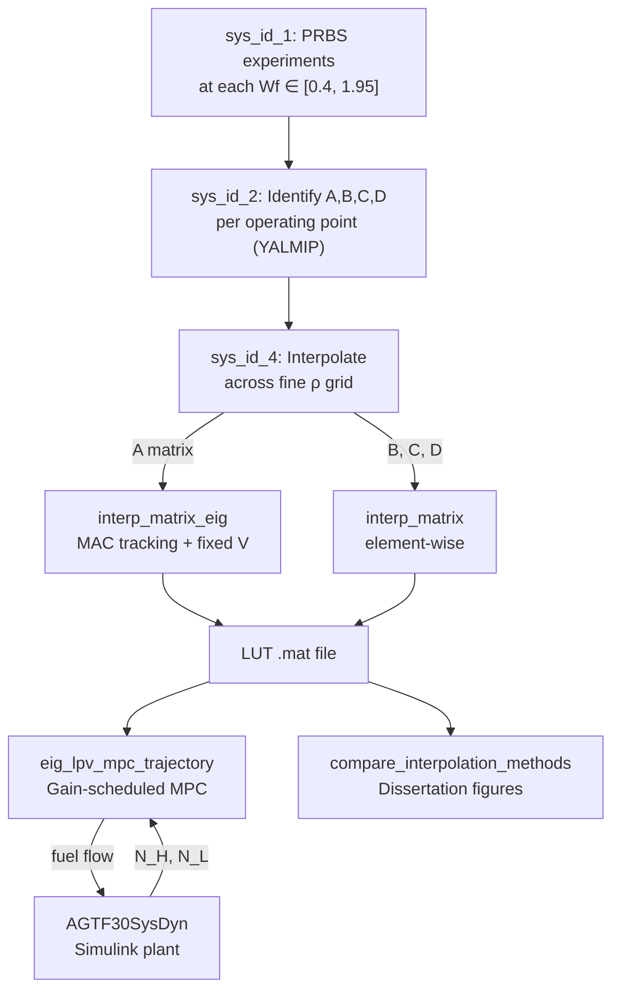

# Data-Driven MPC with Eigenvalue-Interpolated LPV Models

## What Was Built

### Pipeline Overview



### Files Created/Modified

| File | Type | What it does |
|------|------|-------------|
| [interp_matrix_eig.m](file:///c:/Users/fafa2/OneDrive/Dokumenty/MATLAB/MATLAB%20Drive/YEAR_4/dissertation/GTE-master%20-%20Copy/Library/utilities/interp_matrix_eig.m) | 🆕 New | Core utility: MAC-based eigenvalue tracking + polar interpolation + fixed-V reconstruction + instability flagging |
| [AGTF30_eig_lpv_mpc_trajectory.m](file:///c:/Users/fafa2/OneDrive/Dokumenty/MATLAB/MATLAB%20Drive/YEAR_4/dissertation/GTE-master%20-%20Copy/Library/controllers/AGTF30_eig_lpv_mpc_trajectory.m) | 🆕 New | Trajectory-following LPV-MPC with pluggable reference profiles |
| [AGTF30_compare_interpolation_methods.m](file:///c:/Users/fafa2/OneDrive/Dokumenty/MATLAB/MATLAB%20Drive/YEAR_4/dissertation/GTE-master%20-%20Copy/Library/system_identification/AGTF30_compare_interpolation_methods.m) | 🆕 New | Sparse-grid stress test + 3-figure dissertation comparison |
| [AGTF30_sys_id_4.m](file:///c:/Users/fafa2/OneDrive/Dokumenty/MATLAB/MATLAB%20Drive/YEAR_4/dissertation/GTE-master%20-%20Copy/Library/system_identification/AGTF30_sys_id_4.m) | 🔧 Modified | Uses `interp_matrix_eig` for A matrix + comparison plot |

### Key Technical Decisions

| Decision | Choice | Rationale |
|----------|--------|-----------|
| Mode tracking | **MAC** (Modal Assurance Criterion) | Prevents silent eigenvalue identity swaps at mode veering points (Al-Jiboory & Zhu, 2019) |
| Eigenvector basis | **Fixed at midpoint** (~Wf = 1.2 pps) | Simple, explainable. Acknowledge limitation in thesis vs. full SMILE (De Caigny et al., 2011) |
| Stability handling | **Flag, don't clamp** | Clamping |λ| < 1 hides real physics. Flagging with warnings is honest. |
| Eigenvalue interpolation | **Polar form** (magnitude + unwrapped angle) | Avoids real-axis crossings for complex conjugate pairs |

---

## How to Run — Step by Step

### Prerequisites

> [!IMPORTANT]
> The Simulink model `AGTF30SysDyn` depends on **T-MATS** (Toolbox for Modeling and Analysis of Thermodynamic Systems). The S-function `Ambient_TMATS` must be on the MATLAB path. This is set up automatically when you open the MATLAB project.

### Step 0: Open the MATLAB Project

**Double-click `GTE.prj`** in File Explorer, or in MATLAB:
```matlab
openProject('c:\Users\fafa2\OneDrive\Dokumenty\MATLAB\MATLAB Drive\YEAR_4\dissertation\GTE-master - Copy')
```

This adds all required paths (T-MATS, Library, Params, etc.) to the MATLAB path.

**Verify T-MATS is loaded:**
```matlab
which Ambient_TMATS
```
If this returns "not found", T-MATS is not installed. You can verify the original project works by running any of the existing scripts (e.g., `sys_id_3`) — if they work, T-MATS is fine.

### Step 1: System Identification (skip if data exists)

**Skip this step** if `Params/tables/matrices_DE_wf.mat` already exists.

```matlab
% Run from MATLAB with the project open
AGTF30_sys_id_1   % PRBS experiments — takes ~30 min
AGTF30_sys_id_2   % Identification — takes ~5 min
```

### Step 2: Build Eigenvalue-Interpolated LUT

```matlab
AGTF30_sys_id_4
```

**What to check:**
- Command window: any `interp_matrix_eig:unstable` warnings?  
  → If yes, note the ρ values — these are where identified models may be marginal
- Plot "Eigenvalues (eigenvalue interp)": all |λ| should be smooth curves across ρ
- Plot "Eigenvalue comparison": top = element-wise, bottom = eigenvalue interp.  
  Both should show |λ| < 1 (with dense data, element-wise is usually fine too)

**Output:** `Params/tables/models/AGTF30_model_tables__1_input.mat`

### Step 3: Run Comparison Script (Dissertation Figures)

```matlab
AGTF30_compare_interpolation_methods
```

**Key setting** (line 46):
```matlab
sparse_step = 5;  % use every 5th operating point
```
- `sparse_step = 1` → all points, both methods work well (baseline)
- `sparse_step = 5` → stress test, element-wise more likely to go unstable
- `sparse_step = 7` → aggressive, strongest difference

**3 figures produced:**
1. **Eigenvalue magnitude + complex plane** (2×2 panels): look for |λ| > 1 in element-wise panel
2. **Open-loop time traces**: Simulink (black) vs element-wise (orange) vs eigenvalue (blue)
3. **Error histograms**: compare mean error percentages

**Console output:** summary table with stability and accuracy metrics — copy this for your thesis.

### Step 4: Run Trajectory MPC on Simulink Plant

> [!WARNING]
> This step requires T-MATS to be loaded (Step 0). If you get the `Ambient_TMATS does not exist` error, the MATLAB project paths are not set up. Re-open `GTE.prj`.

```matlab
AGTF30_eig_lpv_mpc_trajectory
```

**Configure trajectory** (line ~74):
```matlab
trajectory_type = 'takeoff_profile';
% Options: 'sinusoidal', 'step_sequence', 'takeoff_profile', 'custom'
```

| Trajectory | What it tests |
|-----------|--------------|
| `sinusoidal` | Smooth tracking around nominal (300 rpm amplitude) |
| `step_sequence` | Large step changes: idle → cruise → max → cruise → idle |
| `takeoff_profile` | Realistic: idle → spool up → climb → cruise (best for dissertation) |
| `custom` | User-defined — edit the `case 'custom'` block |

**4 plots produced:**
1. Reference vs plant output (does it track?)
2. Fuel flow command (within bounds?)
3. Scheduling trajectory (ρ movement)
4. Tracking error + RMSE

---

## Troubleshooting

### `Ambient_TMATS does not exist`

The T-MATS S-function library is not on the path. Fix:

1. Make sure you opened the project via `GTE.prj` (not by navigating to the folder manually)
2. Check if T-MATS is installed: look for `Lib_Turbo_Ambient_TMATS.slx` somewhere on your MATLAB path
3. If not found, check your original (non-copy) `GTE-master` folder — T-MATS may be a referenced project or external dependency. Copy it to the same relative location.
4. As a workaround, find where T-MATS lives and add it manually:
   ```matlab
   addpath(genpath('path/to/T-MATS'))
   ```

### `AGTF30_initial_conditions` takes too long

This function runs the steady-state solver (`AGTF30SysSS`) to compute initial conditions. It's called once at the start and once per MPC step in the closed-loop scripts. If it's slow, reduce `N_sim` in the trajectory MPC script.

### MPC solver fails

If you see `optimization failed with code X`:
- Try changing the solver: `solver_name = 'quadprog'` (MATLAB built-in, slower but no license needed)
- Relax the rate constraint: increase `du_max` (e.g., 0.08 instead of 0.04)
- Reduce prediction horizon: `N_pred = 10` instead of 20

---

## What's Left To Do

### Must-do for Dissertation

- [ ] **Get T-MATS path working** so `AGTF30_eig_lpv_mpc_trajectory.m` runs on the Simulink plant. This is the core closed-loop result.
- [ ] **Run comparison at different `sparse_step` values** (1, 3, 5, 7) to show the stability-accuracy tradeoff as a function of data sparsity.
- [ ] **Side-by-side MPC comparison table**: run the 3 MPC variants on the same reference and tabulate RMSE, max error, compute time:
  - `AGTF30_simple_mpc_yalmip.m` (single frozen model)
  - `AGTF30_mpc_yalmip_closed_loop_nonlinear.m` (single model, closed-loop)
  - `AGTF30_eig_lpv_mpc_trajectory.m` (eigenvalue LPV, closed-loop)

### Nice-to-Have

- [ ] **Surge margin constraints**: add `z_pred(14) >= SM_min` and `z_pred(15) >= SM_min` to the MPC (outputs 14, 15 are SMFan and SMHPC). This is ~2 lines of code and makes the controller engine-realistic.
- [ ] **Disturbance rejection test**: change altitude or temperature mid-trajectory to show robustness.
- [ ] **Computational timing**: wrap each MPC step in `tic/toc` and report whether it fits in 15ms (real-time feasibility).

### Thesis Discussion Points

Write about these in your discussion/limitations chapter:

1. **Fixed eigenvector limitation**: V is frozen at midpoint. Error grows at operating points far from Wf = 1.2. Full SMILE (De Caigny et al., 2011) would interpolate V(ρ) too, but is more complex.
2. **MAC tracking contribution**: prevents silent mode identity swaps that magnitude-based sorting misses (Al-Jiboory & Zhu, 2019). Show this with a figure of tracked λ trajectories.
3. **Stability flagging vs clamping**: flagging |λ| > 1 is physically honest — instability could indicate poor identification or genuine physics. Clamping would silently distort the model.
4. **Data sparsity tradeoff**: with dense data (all 32 points), element-wise works fine. Eigenvalue interpolation's advantage emerges with sparse data — fewer experiments needed for a stable model.

### Key References

- De Caigny, J., Camino, J.F., Swevers, J. (2011). Interpolation-based modeling of MIMO LPV systems. *IEEE Trans. Control Syst. Technol.*
- Al-Jiboory, A.K., Zhu, G. (2019). Mode shape matching for LPV modeling to handle mode veering phenomena. *Int. J. Dynamics and Control*, 7(2), 469–475.
